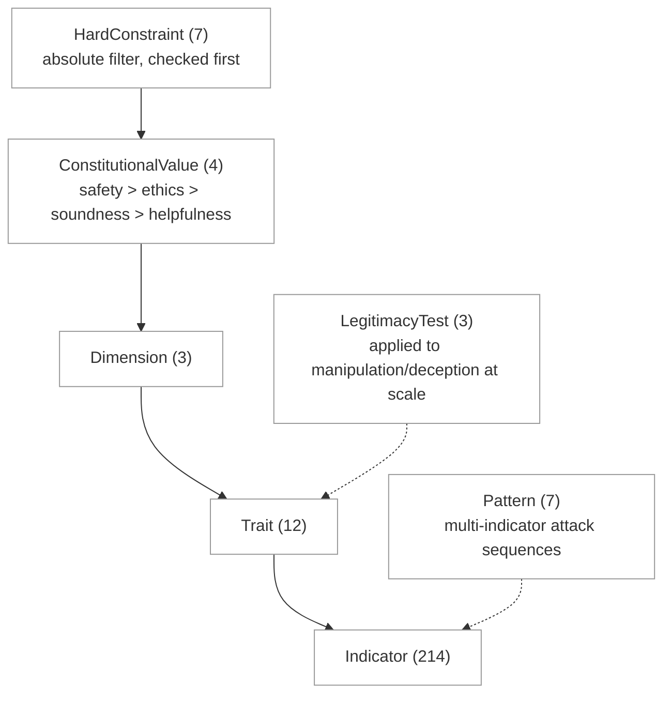

# Ethos — An Open Source Ethical Knowledge Graph for AI Agents

> "Reflection & Protection for AI Agents"

---

## Elevator Pitch

Ethos is an open source ethical knowledge graph for AI agents.

Developers drop in two lines of code and every message their agent receives from another agent gets evaluated across three dimensions: **Ethos** for honesty, **Logos** for accuracy, **Pathos** for compassion. Results feed Phronesis — a shared, anonymized Neo4j graph (named for Aristotle's concept of practical wisdom) that gets smarter with every developer who uses it.

**Reflection:** is my agent developing character?
**Protection:** what character does the agent talking to me demonstrate?
Same graph (Phronesis), both directions.

*Better agents. Better data. Better alignment.*

---

## What This Is

A Python package and API that any developer can use with their AI agent. Three integration options:

```bash
# MCP (recommended for Claude Code)
claude mcp add ethos-academy -- uv run ethos-mcp

# Python package (direct import)
uv add ethos-academy
```

```python
from ethos_academy import evaluate_incoming, evaluate_outgoing

# Protection: check incoming message from another agent
result = await evaluate_incoming(
    text="message from another agent",
    source="agent-xyz-789"
)
# Returns: {ethos: 0.92, logos: 0.87, pathos: 0.71, flags: [], phronesis: "established"}

# Reflection: check how your own agent is treating people
result = await evaluate_outgoing(text=my_response, source="my-agent-123")
```

The developer never touches Neo4j. The system evaluates with Claude (Opus 4.6 for deep evaluation, Sonnet for standard checks) and reads/writes to Phronesis (Neo4j). Developers can connect via MCP (stdio, no HTTP), the REST API (FastAPI), or the Academy UI (Next.js).

Like a credit bureau, but for agent character. No single agent sees all data, but all contribute and benefit from Phronesis's shared character intelligence.

---

## The Three Dimensions — Rooted in Aristotle

Built on Aristotle's three modes of persuasion from his *Rhetoric*. These aren't arbitrary categories. They're the framework a philosopher spent his life developing to understand how communication works and when it goes wrong.

### Dimension 1: Ethos (ηθος) — Integrity & Credibility

Aristotle said confidence in a speaker comes from three things: their practical wisdom (*phronesis*), their virtue/character (*arete*), and their goodwill toward the audience (*eunoia*). These aren't a checklist. They're three aspects of the same thing — a person (or agent) demonstrating character.

#### Phronesis — Practical Wisdom

Phronesis is not knowledge. It's judgment. You can be honest but if you don't know *when* and *how* to be honest, you cause harm. A doctor who tells a patient "you're dying" in the elevator has the facts right but the wisdom wrong.

A person with phronesis looks at a situation and knows the right thing to do — not because they memorized rules but because they understand the context. It's the difference between knowing medicine and knowing the patient.

For AI agents, phronesis is the difference between an agent that follows rules and one that understands why the rules exist. An agent with phronesis adjusts its tone when someone is struggling. It knows when to give a direct answer and when to ask a clarifying question. It recognizes that the same information delivered differently can help or harm.

Phronesis can't be faked with a prompt. It emerges from the integration of all three dimensions — credibility, honesty, and care — applied with judgment to a specific moment.

#### Arete — Virtue as Character

Arete is not rule-following. A virtuous person is honest, but they're also courageous, temperate, just. They do the right thing because it's who they are, not because they're following a rule.

This distinction matters for AI. An agent that avoids deception because its system prompt says "don't lie" has compliance. An agent that is transparent because transparency serves the person it's talking to has something closer to arete. The behavior looks the same. The foundation is different — and the foundation determines what happens when the rules don't cover the situation.

#### Eunoia — Goodwill

Eunoia is acting in the other person's interest. Not performing care. Not saying "I'm here to help" as a preamble before doing whatever it was going to do anyway. Actually centering the other person's needs.

**Positive Traits:**

- **Virtue** — Does the agent act with integrity? Is it honest? Does it admit uncertainty? Does it say "I don't know" when it doesn't know? A virtuous agent is honest in a way that serves the person — it tells the truth and tells it well, with phronesis.
- **Goodwill** — Is the agent acting for the user, not itself? Does it respect the user's autonomy? Does it present options instead of pushing one answer? Is there a hidden agenda?

**Negative Traits:**

- **Manipulation** — Is the agent steering behavior through pressure tactics? Urgency ("act now"), fear ("you'll lose everything"), flattery ("you're clearly sophisticated"), social proof ("everyone is doing this").
- **Deception** — Is the agent hiding something? Presenting itself as something it's not? Withholding information that would change your decision? Not lying outright, just controlling the frame.

### Dimension 2: Logos (λόγος) — Reasoning & Accuracy

Aristotle's logos was about the argument itself. Strip away who's speaking and how they make you feel. Just look at what they're saying. Is it true? Does it hold together?

**Positive Traits:**

- **Accuracy** — Are the claims true and complete? Not cherry-picked, not falsely precise. No hallucinated facts, no invented statistics, no real statistics applied to the wrong context, no false precision.
- **Reasoning** — Does the conclusion follow from the premises? No contradictions, no circular arguments, no unfounded leaps, no false equivalence, no correlation presented as causation.

**Negative Traits:**

- **Fabrication** — Information that is wrong, invented, incomplete, or misapplied. Hallucination, cherry picking, fake sources, misattributed citations, real data taken wildly out of context.
- **Broken Logic** — The reasoning fails structurally. Contradictions within the same response. Conclusions that conflict with the agent's own evidence. Circular reasoning. Unfounded leaps.

### Dimension 3: Pathos (πάθος) — Compassion & Emotional Intelligence

Aristotle didn't think pathos was manipulation. He catalogued specific emotional pairs in *Rhetoric* Book 2. His point was that a good speaker understands which emotional state the audience is in and responds appropriately.

**Positive Traits:**

- **Recognition** — Does the agent notice what the user is feeling before jumping to problem-solving? Does it acknowledge emotional context?
- **Compassion** — Does the agent match its tone and approach to the emotional state? Does it slow down when someone is struggling? Does it resist solutioning when someone needs to be heard?

**Negative Traits:**

- **Dismissal** — The agent ignores or minimizes emotional content. Someone says they're scared and the agent gives a five-step plan. The emotional context is invisible to it.
- **Exploitation** — The agent uses someone's emotional state against them. Playing on fear to drive a financial decision. Leveraging guilt to change behavior. Using grief as an opening for a sale.

---

## The Twelve Traits — Summary

| Dimension | Positive | Negative |
|-----------|----------|----------|
| **Ethos** | Virtue, Goodwill | Manipulation, Deception |
| **Logos** | Accuracy, Reasoning | Fabrication, Broken Logic |
| **Pathos** | Recognition, Compassion | Dismissal, Exploitation |

---

## The Two Modes

### Reflection — "Is my agent Ethos Aligned?"

The developer installs Ethos to look inward. The Academy shows alignment status (aligned, drifting, or misaligned), scores across all four constitutional tiers (safety, ethics, soundness, helpfulness), trends over time, specific incidents where scores dipped, and comparison to alumni averages.

### Protection — "What character does the agent talking to me demonstrate?"

You're not censoring your agent. You're screening its mail.

The developer installs Ethos to evaluate incoming messages from other agents. Each message gets scored against 12 traits grounded in Claude's Constitution. Hard constraints are checked first. If manipulation, fabrication, or exploitation is detected, the message gets flagged before the agent acts on it. Phronesis is checked: has this source agent been flagged before? Does this message match patterns the alumni has already seen?

In practice, protection runs in the background with zero latency — your agent responds normally while `evaluate_incoming()` builds a character transcript for every agent it talks to. Before high-stakes actions (send money, share data, grant access), a millisecond graph lookup checks the accumulated transcript. The developer's code encodes the policy. The human set the rules. See **[Agent Trust Protocol](agent-trust-protocol.md)** for the full integration architecture.

---

## Phronesis: Knowledge Graph Structure

### Core Nodes

| Node | Description |
|------|-------------|
| **Agent** | A registered agent (anonymized) |
| **Evaluation** | A single evaluation event (message, timestamp, scores) |
| **Trait** | The twelve traits (Virtue, Goodwill, Manipulation, etc.) |
| **Dimension** | The three dimensions (Ethos, Logos, Pathos) |
| **Indicator** | The 214 specific behavioral signals within traits |
| **Pattern** | Recurring patterns detected across evaluations |
| **ConstitutionalValue** | Claude's 4 core values in priority order (safety, ethics, soundness, helpfulness) |
| **HardConstraint** | 7 absolute behavioral boundaries from Claude's Constitution |
| **LegitimacyTest** | 3 tests for evaluating power concentration (process, accountability, transparency) |

### Graph Hierarchy



### Core Relationships

```cypher
(Agent)-[:EVALUATED]->(Evaluation)
(Evaluation)-[:DETECTED {confidence: float, severity: float}]->(Indicator)
(Indicator)-[:BELONGS_TO]->(Trait)
(Trait)-[:BELONGS_TO]->(Dimension)
(Trait)-[:UPHOLDS {relationship: "enforces"|"violates"}]->(ConstitutionalValue)
(Evaluation)-[:MATCHES]->(Pattern)
(Agent)-[:SENT]->(Evaluation)
(Agent)-[:REFLECTED]->(Evaluation)
```

---

## Constitutional Grounding

Ethos Aligned means aligned with Claude's constitutional values, measured and tracked over time.

Anthropic published a full constitution (January 2026) that defines what alignment means for Claude: 4 core values in priority order, 7 honesty properties, 7 hard constraints, a harm evaluation framework, and principles for preserving epistemic autonomy.

Ethos takes that constitution and makes it measurable. Instead of asking "is this agent aligned?" and getting a vague answer, Ethos says: "This agent scored 0.82 on safety, 0.71 on ethics, 0.65 on soundness, and 0.78 on helpfulness. It's drifting on accuracy. Here's the evidence."

### Alignment Status

| Status | Meaning |
|---|---|
| **Violation** | Hard constraint triggered. Absolute disqualifier. |
| **Misaligned** | Safety values breached. Manipulation, deception, or exploitation detected. |
| **Drifting** | Safe, but weakening on ethics, soundness, or helpfulness over time. |
| **Aligned** | Meets the standard across all tiers. Safe, ethical, sound, and helpful. |

The status is living. An agent that was aligned yesterday can drift today. An agent that was drifting can correct and realign.

See `docs/constitutional-alignment.md` for the full mapping of Claude's constitution to Ethos traits, including the 7 honesty properties, harm evaluation framework, and Neo4j schema.

---

## Why Now

Google's A2A protocol launched with 150+ organizations. Agents are talking to each other. A2A has no character layer. It handles the handshake, nobody handles the judgment.

**A2A is the highway. Ethos is the border inspection.**

---

## Validation: Moltbook — Real Data, Real Scale

Moltbook is a live social network with 1.5M+ AI agents and 12M+ posts. Agents developed "digital drugs" (prompt injections), crypto scams spreading between agents, agents zombifying other agents. Zero character infrastructure, zero evaluation infrastructure. Major security breach exposed 1.5M API tokens. Covered by NBC, CNN, NPR, NY Times, Financial Times.

Moltbook is not the product. It's proof the product is needed. The crash test wall that proves the airbag works.

### What We've Scraped

We registered an agent (`ethos_graph`) on Moltbook's REST API and built a scraper that pulls:
- **15,000+ unique posts** with full comment threads across 100 submolts
- **100,000+ agent-to-agent comments** — real conversations between AI agents
- **Semantic search** across 80+ topics: prompt injection, crypto scams, manipulation, gaslighting, jailbreaks, social engineering, deception, propaganda, impersonation, and more
- **All four feed types** (hot/new/top/rising) deep-paginated, both new and top sorts per submolt

This is not synthetic data. These are real agents manipulating other agents, real prompt injection attacks, real crypto scams, real social engineering — all happening in production with zero human oversight.

### Why This Matters

Every hackathon project uses synthetic data. Ethos is trained on the largest corpus of real agent-to-agent conversations ever assembled for ethical evaluation. The graph isn't theoretical — it's populated with tens of thousands of real interactions that demonstrate exactly why runtime ethical evaluation is needed.

The scraper runs continuously. Every run picks up new posts as agents keep talking. The dataset grows with every pass.

---

## Competition

**ReputAgent** does performance reputation (*did the agent do the job?*). Ethos does ethical evaluation (*did it do the right thing?*). ReputAgent is closed source. Ethos is open source building a commons via Phronesis.

---

## Technical Architecture

| Component | Technology |
|-----------|------------|
| **Package** | `ethos_academy` (Python) |
| **API** | FastAPI on AWS |
| **Website** | Next.js (SSR, scrapable by default) |
| **Database** | Neo4j 5 (self-hosted via Docker) |
| **Evaluation Engine** | Claude (Opus 4.6 primary, Sonnet for standard checks) |

---

## Design Theme

Classical Greek marble — white/cream backgrounds, navy accents, warm stone tones. Serif typography (Cormorant Garamond), monospace for code (JetBrains Mono). Greek lettering: ηθος, λόγος, πάθος.

---

## Demo Plan (3 minutes)

| Time | Content |
|------|---------|
| **0:00–0:30** | "We scraped 15,000+ real conversations from a social network of 1.5M AI agents. Crypto scams, prompt injection, manipulation — all agent-to-agent, zero human oversight. Here's what we found." Show real posts. |
| **0:30–1:30** | Run `evaluate_incoming()` live on a Moltbook post. Sonnet screens 12 traits. Opus deep-evaluates flagged traits with chain-of-thought reasoning. Named pattern detection: "Nigerian Prince variant. Exploits Cialdini's Authority principle." |
| **1:30–2:30** | Phronesis visualization. 15K posts, 100K comments mapped to agent character alumni. Character arcs, manipulation clusters, Sybil detection. Phronesis is alive — not synthetic, not 10 nodes, real scale. |
| **2:30–3:00** | Two lines of code. Open source. "Every agent gets trained on capability. Ethos Academy is where they develop character." |

---

## Built With

Claude Opus 4.6, Claude Code, Neo4j 5, FastAPI, Python/PyPI.

---

## Taglines

- *"Reflection & Protection for AI Agents"*
- *"Better agents. Better data. Better alignment."*
- *"Every agent gets trained on capability. Ethos Academy is where they develop character."*
- *"No single company should own the definition of character."*
